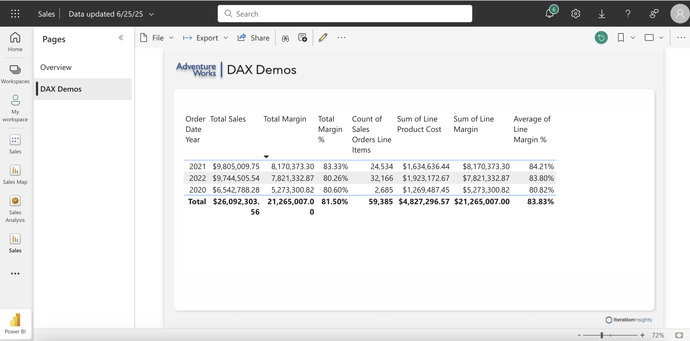
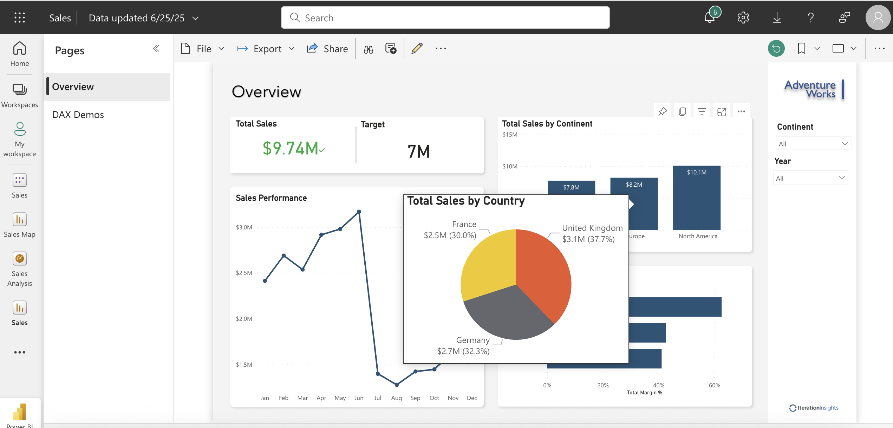
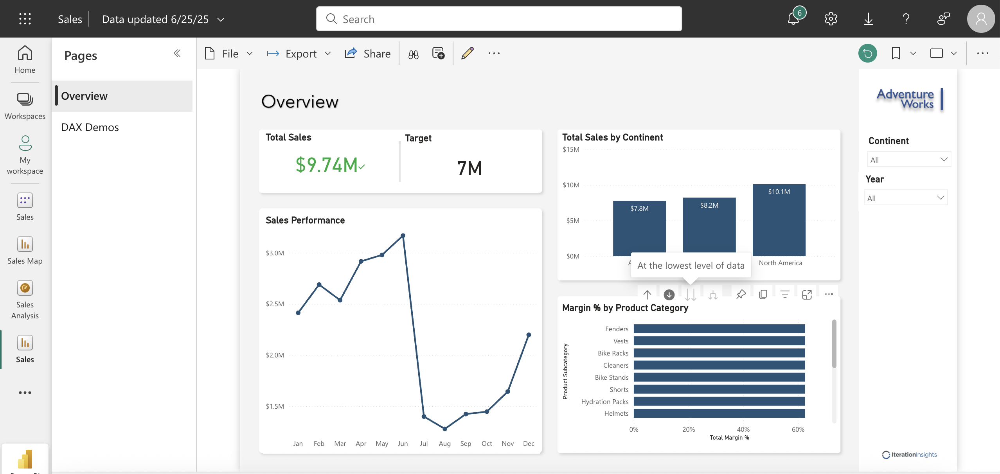
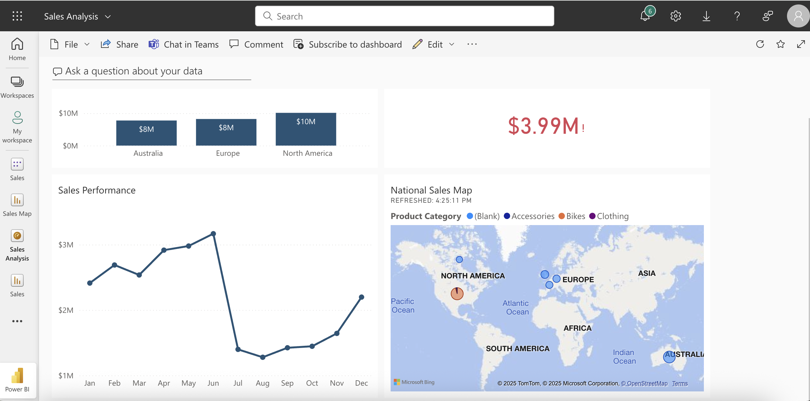

# 📊 AdventureWorks Sales Analysis Dashboard

A Power BI project designed to modernize sales reporting for **AdventureWorks**, a global cycling company. This solution replaces manual, Excel-based processes with a dynamic, automated dashboard, providing real-time insights to business stakeholders across multiple countries.

---

## 🧩 Problem Statement

AdventureWorks previously used static, bi-monthly Excel reports to analyze sales performance. These reports were time-consuming to update, lacked interactivity, and did not provide timely business insights. The CEO required a more automated, visual, and frequently updated reporting solution.

---

## 💡 Solution Overview

This Power BI project delivers a fully interactive **Sales Report and Dashboard** that enables executives to monitor performance by product, region, and time—updated daily and accessible from any device.

---

## ⚙️ Process Flow

The project follows a complete Power BI development lifecycle:

1. **Get Data**

   - Load data from multiple sources (Excel and text files).

2. **Power BI Desktop – Power Query Editor**

   - Perform ETL (Extract, Transform, Load) operations.
   - Clean and shape the data using **Power Query (M language)**.

3. **Data Modeling**

   - Create relationships between tables.
   - Define hierarchies (e.g., Year → Month → Day).
   - Use DAX formulas for calculated columns and measures.
     

4. **Report Design**

   - Create visuals: bar charts, KPIs, cards, slicers, and line charts.
   - Apply formatting, themes, canvas background, and tooltips.
   - Add drill-through, drill-down, conditional formatting, and bookmarks for interactivity.
     
     

5. **Publish & Share**
   - Publish the report to Power BI Service (workspace).
   - Pin tiles to a dashboard for quick, high-level insights.
   - Enable **scheduled refresh** to ensure live data updates.
     

---

## 📁 Project Structure

```
Sales-Analysis-PowerBI/
├── data/ # Input files (.txt, .xlsx)
├── report/ # Power BI report file (.pbix)
├── dashboard/ # Dashboard screenshots (.png)
└── README.md # Project overview and process
```
